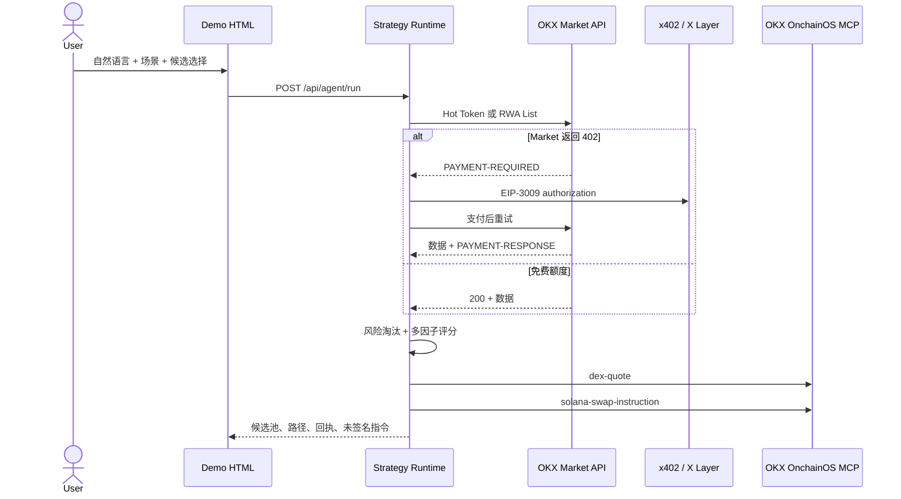

# AgentPay Trade Lab

> Kiki's Knowledge Base · Agent Labs 开源实践项目

一个可直接运行、录屏和开源的 AI 自主交易 Demo。Agent 通过自然语言读取 OKX Market 数据，用确定性策略筛选代币，再通过 OKX OnchainOS MCP 完成 DEX 报价和 Solana 交易指令构建。Market API 只有在真实返回 HTTP 402 时才触发 x402 微支付。

> 仅用于协议与工程实践，不构成投资建议。项目只构建未签名 Solana 指令，不持有 Solana 私钥，也不会广播交易。

## 两个演示场景

### 1. 社媒热榜 + x402

- 查询 Solana 24h X/Twitter mentions 热榜；
- 综合社媒指标 40%、市值 30%、24h 成交量 30%；
- 用 Advanced Info 排除貔貅盘、低流动性、开发者减仓/清仓和 Rug Pull 历史；
- 从合格候选中自动选择第一名，也可以在 UI 中手动选币；
- Demo 数据固定模拟一次 402，完整展示 challenge、EIP-3009 authorization 和 settlement。

### 2. Solana RWA

- 查询 OKX Market RWA token list，限定 `chainIndex=501`；
- 综合市值 55% 与 24h 成交量 45%；
- 排除发行方 paused/closed 标签；
- Demo 模拟命中免费额度，显示 `FREE QUOTA`，执行流中不会出现不必要的支付步骤。

两个场景随后都会调用：

- `dex-okx-dex-quote`
- `dex-okx-dex-solana-swap-instruction`

## 架构



实现细节见 [docs/ARCHITECTURE.md](docs/ARCHITECTURE.md)。

## 项目结构

```text
.
├── public/             # 可直接录屏的双场景 Web UI
├── src/
│   ├── agent/          # 意图解析、策略评分和工作流
│   ├── market/         # 明确标记的 Demo 数据
│   ├── mcp/            # OKX MCP Live/Demo 适配器
│   ├── okx/            # OKX 鉴权与 token 元数据
│   └── x402/           # 按需支付、策略限制和回执
├── test/               # Node 内置测试
├── docs/               # 架构与发布说明
└── .github/            # CI、Issue 和 PR 模板
```

## 快速开始

Demo 模式只要求 Node.js 20+，不安装依赖也能运行：

```bash
node src/server.js
```

打开 [http://localhost:4021](http://localhost:4021)，选择“社媒热榜”或“Solana RWA”，点击“分析并构建”。首次运行自动选择第一名；点击任意 `PASS` 候选后再次运行，会按该代币重新报价。

运行测试：

```bash
node scripts/check.js
node --test
```

CLI 示例：

```bash
node src/client.js --mode demo --scenario social-hot "用 25 USDC 构建交易预览"
node src/client.js --mode demo --scenario solana-rwa "筛选 Solana RWA，用 50 USDC 构建交易预览"
```

## Live 模式

1. 在 [OKX OnchainOS Developer Portal](https://web3.okx.com/onchainos/dev-portal/project) 创建项目。
2. 准备一个仅用于 x402 的 EVM 演示钱包，在 X Layer 持有少量 USDG 或 USDT。
3. 准备一个公开的 Solana 钱包地址，用于构建 instruction；本项目不需要其私钥。
4. 安装依赖，复制环境变量并启动：

```bash
pnpm install
cp .env.example .env
pnpm start
```

最小 Live 配置：

```env
APP_MODE=live
OKX_ACCESS_KEY=...
OKX_SECRET_KEY=...
OKX_PASSPHRASE=...
EVM_PRIVATE_KEY=0x...
SOLANA_WALLET_ADDRESS=...
X402_PAYMENT_TOKEN=USDG
X402_MAX_AMOUNT_ATOMIC=10000
```

`EVM_PRIVATE_KEY` 只负责 X Layer x402 支付；`SOLANA_WALLET_ADDRESS` 只作为未签名交易的公开目标地址。不要在 Issue、聊天、截图或录屏中展示私钥。

### x402 支付策略

| 设置 | 值 |
| --- | --- |
| Network | `eip155:196` |
| USDG | `0x4ae46a509f6b1d9056937ba4500cb143933d2dc8` |
| USDT | `0x779ded0c9e1022225f8e0630b35a9b54be713736` |
| Client cap | `X402_MAX_AMOUNT_ATOMIC` |

USDG/USDT 按 6 位精度显示。`10000` atomic units 等于 `0.01` token。若 API 直接返回 200，页面显示 `FREE QUOTA`；只有 HTTP 402 才会签名和结算。

## HTTP API

| 方法 | 路径 | 说明 |
| --- | --- | --- |
| `GET` | `/api/health` | 服务与 Live 配置状态 |
| `GET` | `/api/config` | 可公开的 UI 配置，不含 Secret |
| `GET` | `/api/mcp/tools?mode=demo` | MCP 工具和输入 Schema |
| `POST` | `/api/agent/run` | 执行指定场景 |

```bash
curl -sS http://localhost:4021/api/agent/run \
  -H 'Content-Type: application/json' \
  -d '{
    "mode": "demo",
    "scenario": "social-hot",
    "selectedTokenAddress": null,
    "previewOnly": true,
    "message": "排除危险标签，用 25 USDC 构建交易预览"
  }'
```

## Demo 数据边界

Demo 模式的候选行情、风险标签、报价和支付回执都带有 `simulated: true`，用于稳定录屏，不能作为真实行情或链上证明。Live 模式才会访问官方 API 和 MCP。

## 官方参考

- [OKX DEX AI Tools MCP Server](https://web3.okx.com/onchainos/dev-docs/trade/dex-ai-tools-mcp-server)
- [OKX Market AI Tools MCP Server](https://web3.okx.com/onchainos/dev-docs/market/market-ai-tools-mcp-server)
- [Hot Token API](https://web3.okx.com/onchainos/dev-docs/market/market-token-hot-token)
- [Token Advanced Info API](https://web3.okx.com/onchainos/dev-docs/market/market-token-advanced-info)
- [RWA Token API](https://web3.okx.com/onchainos/dev-docs/market/market-rwa-token)
- [Solana Swap Instruction API](https://web3.okx.com/onchainos/dev-docs/trade/dex-solana-swap-instruction)
- [Market API fee](https://web3.okx.com/onchainos/dev-docs/market/market-api-fee)
- [x402 payment](https://web3.okx.com/onchainos/dev-docs/market/how-to-finish-api-payment)

## 开源

MIT License。提交改动前请阅读 [CONTRIBUTING.md](CONTRIBUTING.md) 与 [SECURITY.md](SECURITY.md)。

准备创建公开仓库时，请按 [GitHub Publishing Guide](docs/GITHUB_PUBLISHING.md) 检查仓库名称、Topics、首次提交、分支保护和 Release。
